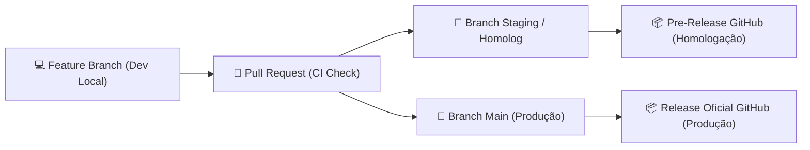

# 🚀 Guia de Deploy e Releases — Margem.AI

Este documento descreve o fluxo de trabalho de Integração Contínua e Entrega Contínua (**CI/CD**), explicando como disparar, monitorar e executar os deploys nos ambientes de **Homologação (Staging)** e **Produção (Main)**.

---

## 🏗️ 1. Visão Geral dos Ambientes



| Ambiente | Branch / Gatilho | Objetivo | Artefatos Gerados |
| :--- | :--- | :--- | :--- |
| **Local / Dev** | `feature/us-XX-...` | Desenvolvimento e testes locais | `target/` e `dist/` |
| **Homologação** | Branch `staging` / `homolog` ou disparo manual | Validação de novas features pela equipe/cliente | `margemai-backend-homolog.jar`<br>`margemai-frontend-homolog.zip` |
| **Produção** | Merge de PR na branch `main` | Versão estável oficial para usuários finais | `margemai-backend-production.jar`<br>`margemai-frontend-production.zip` |

---

## 🎯 2. Como Executar o Deploy de Homologação

O pipeline de homologação gera uma **Pre-Release no GitHub** contendo as notas de versão automáticas e os binários compilados.

### Opção A: Automático via Git (Branch Staging)
1. Certifique-se de que sua branch de feature está atualizada com a `main`.
2. Envie suas alterações para a branch `staging` ou `homolog`:
   ```bash
   git checkout staging
   git merge feature/us-01-cadastro-usuario-mei
   git push origin staging
   ```
3. O GitHub Actions iniciará automaticamente o workflow **`Release Homologação (Pre-Release)`**.

### Opção B: Disparo Manual pelo Painel do GitHub Actions
1. Acesse a aba [**Actions do Repositório**](https://github.com/ErickHTF/margemAI/actions).
2. No menu lateral esquerdo, clique em **`Release Homologação (Pre-Release)`**.
3. Clique no botão **`Run workflow`**.
4. *(Opcional)* Escolha a branch desejada e defina o sufixo da versão (ex: `rc.1`, `beta.1`).
5. Clique em **`Run workflow`**.

### 📥 Onde Baixar o Pacote de Homologação:
* Acesse a seção [**Releases do GitHub**](https://github.com/ErickHTF/margemAI/releases).
* As releases de homologação estarão marcadas com a etiqueta **`Pre-release`** (ex: `v0.1.0-rc.1.20260825-1410`).
* Na seção **Assets**, baixe o `.jar` do backend e o `.zip` do frontend.

---

## 🚢 3. Como Executar o Deploy de Produção

O deploy de produção segue o padrão **Trunk-Based**: ao aprovar e realizar o merge de um Pull Request na branch `main`, o GitHub Actions valida os testes, compila os artefatos de produção e publica uma **Release Oficial no GitHub**.

### Opção A: Automático via Merge de Pull Request (Recomendado)
1. Abra um **Pull Request** da sua branch `feature/*` apontando para a `main`.
2. Aguarde a execução e aprovação do workflow **`Continuous Integration (CI)`**.
3. Realize o **Merge** do Pull Request no GitHub.
4. O workflow **`Release Produção (Main Merge)`** será disparado automaticamente:
   * Valida novamente a suíte completa de testes.
   * Compila o backend e o frontend com otimizações de produção.
   * Calcula a tag semântica (ex: `v0.1.35`).
   * Cria a **Release Oficial** com changelog gerado automaticamente.

### Opção B: Disparo Manual com Tag Customizada
1. Acesse a aba [**Actions do Repositório**](https://github.com/ErickHTF/margemAI/actions).
2. Clique no workflow **`Release Produção (Main Merge)`**.
3. Clique em **`Run workflow`**, selecione a branch `main` e informe a tag desejada no campo `version_tag` (ex: `v1.0.0`).
4. Clique em **`Run workflow`**.

---

## 💻 4. Como Executar os Artefatos Baixados

### ☕ Executando o Backend (Java / Spring Boot)
Requisito: Java 21 instalado (`java -version`).

```bash
# Execução direta com porta padrão (8080)
java -jar margemai-backend-production.jar

# Execução com variáveis de ambiente customizadas
java -Dserver.port=8080 \
     -Djwt.secret="SUA_CHAVE_SECRETA_JWT_AQUI" \
     -jar margemai-backend-production.jar
```

### ⚛️ Servindo o Frontend (React / Vite Build)
O arquivo `.zip` contém os arquivos estáticos pré-compilados (`index.html`, `.js`, `.css`, assets).

* **Com Node.js (`serve`):**
  ```bash
  unzip margemai-frontend-production.zip -d dist
  npx serve -s dist -l 3000
  ```
* **Com Nginx:**
  Copie o conteúdo descompactado para a pasta `/var/www/html/` ou `/usr/share/nginx/html/`.

---

## 🔒 5. Variáveis de Ambiente e Configurações

| Variável / Propriedade | Padrão | Descrição |
| :--- | :--- | :--- |
| `SERVER_PORT` / `server.port` | `8080` | Porta HTTP da API backend |
| `JWT_SECRET` / `jwt.secret` | *(chave 256-bit padrão)* | Segredo HMAC-SHA para assinatura de tokens JWT |
| `SPRING_DATASOURCE_URL` | `jdbc:h2:mem:margemdb` | URL de conexão com o banco de dados (H2 ou PostgreSQL) |
| `SPRING_DATASOURCE_USERNAME` | `sa` | Usuário do banco de dados |
| `SPRING_DATASOURCE_PASSWORD` | ` ` | Senha do banco de dados |
| `VITE_API_BASE_URL` | `http://localhost:8080/v1` | URL base do backend consumida pelo frontend |
